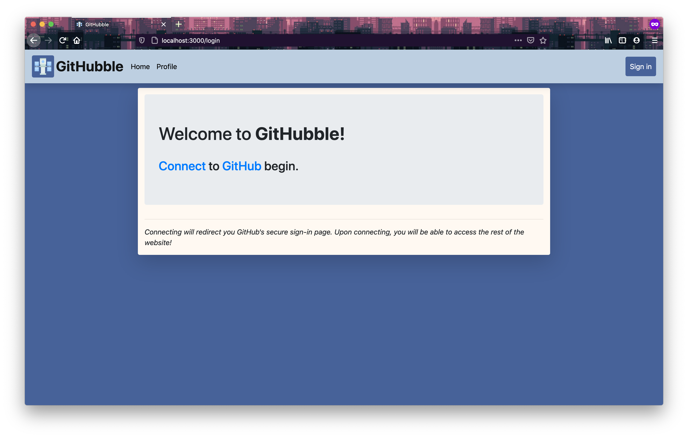
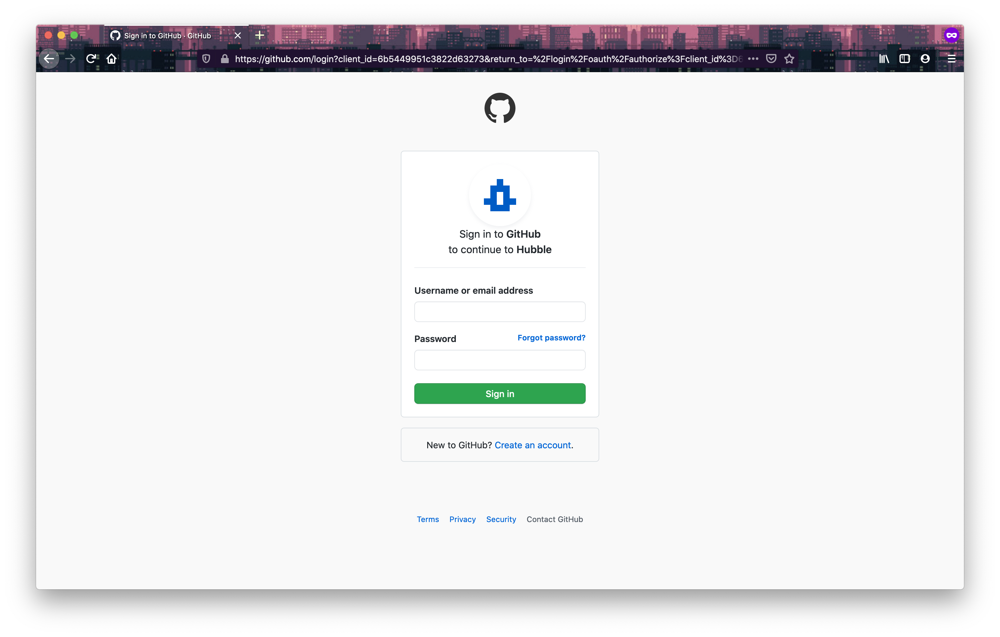
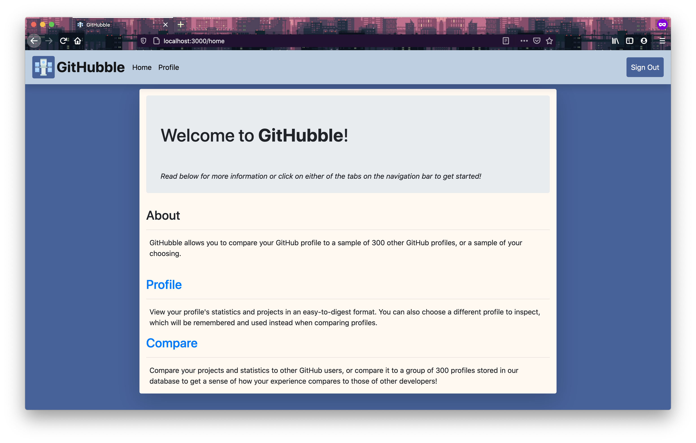
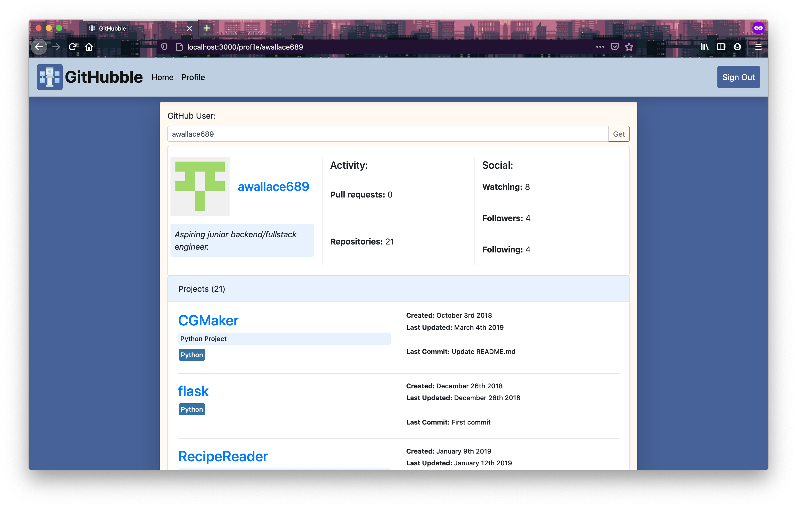
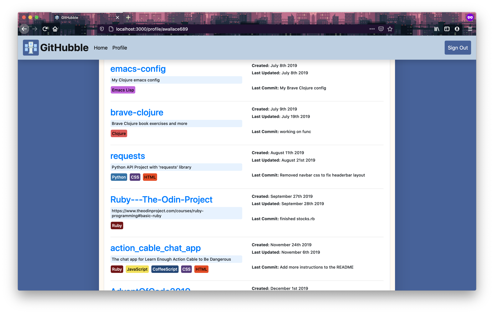
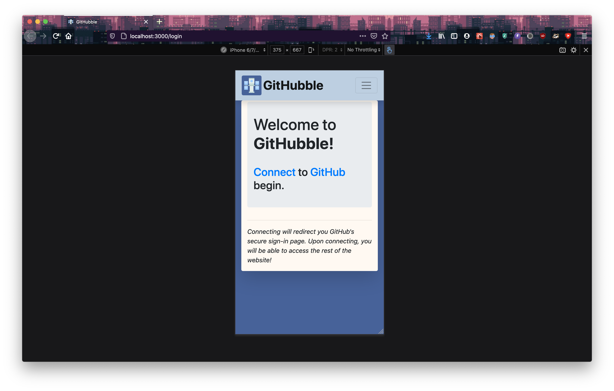
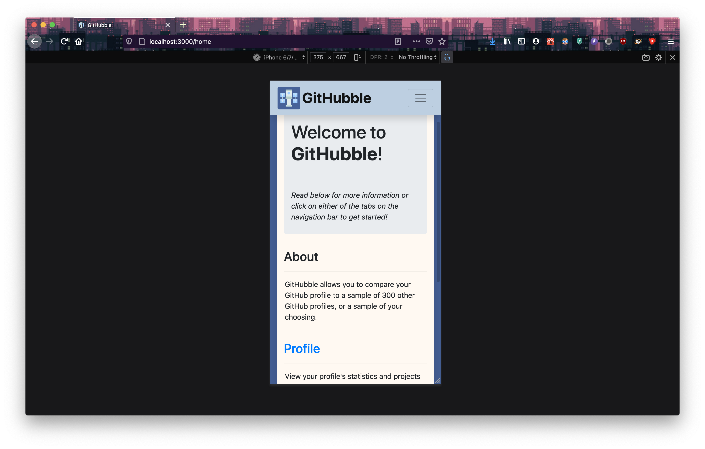
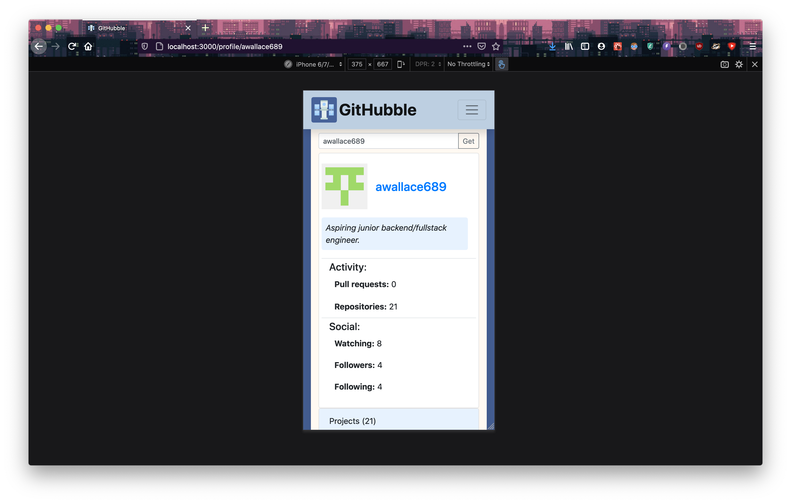
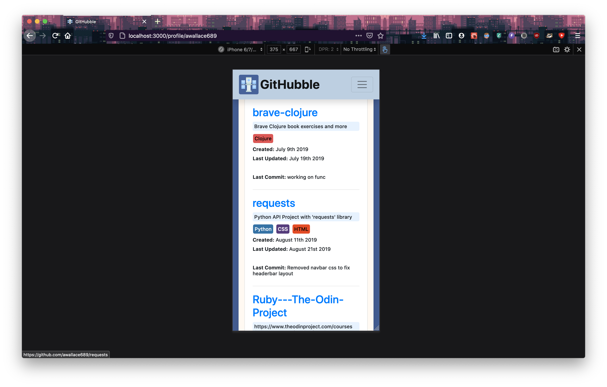

# RUN Express.js API
    > cd api
    > npm install
    > npm start

# RUN React.js Client
    > npm start
Navigate to https://localhost:3000

# About

Web app for comparing your GitHub profile to a sample of ~~300+~~ 800+ other GitHub users.

Made with the MERN (MongoDB, Express.js, React.js, Node.js) stack and GraphQL!

# Desktop Screenshots

## Landing Page
Prompts user to authenticate GitHubble so that they can proceed to the website content. Stores authentication details in browser LocalStorage (Github OAuth tokens never expire).

## OAuth Redirect

## Home Page
Visual representation of the project routes.

## Profile Page
See a clean overview of any GitHub profile! The authenticated profile is shown be default.

Any of these project links can be clicked to open the project source on GitHub in a new tab.

## Compare Page
WIP, check back soon!

# Mobile Screenshots
## Landing Page

## Home Page

## Profile Page

